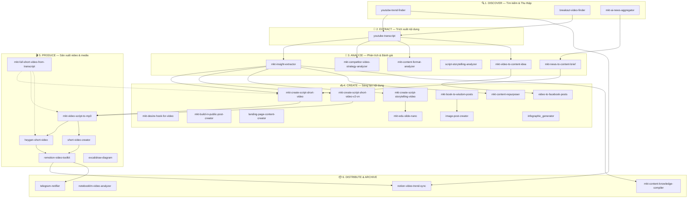
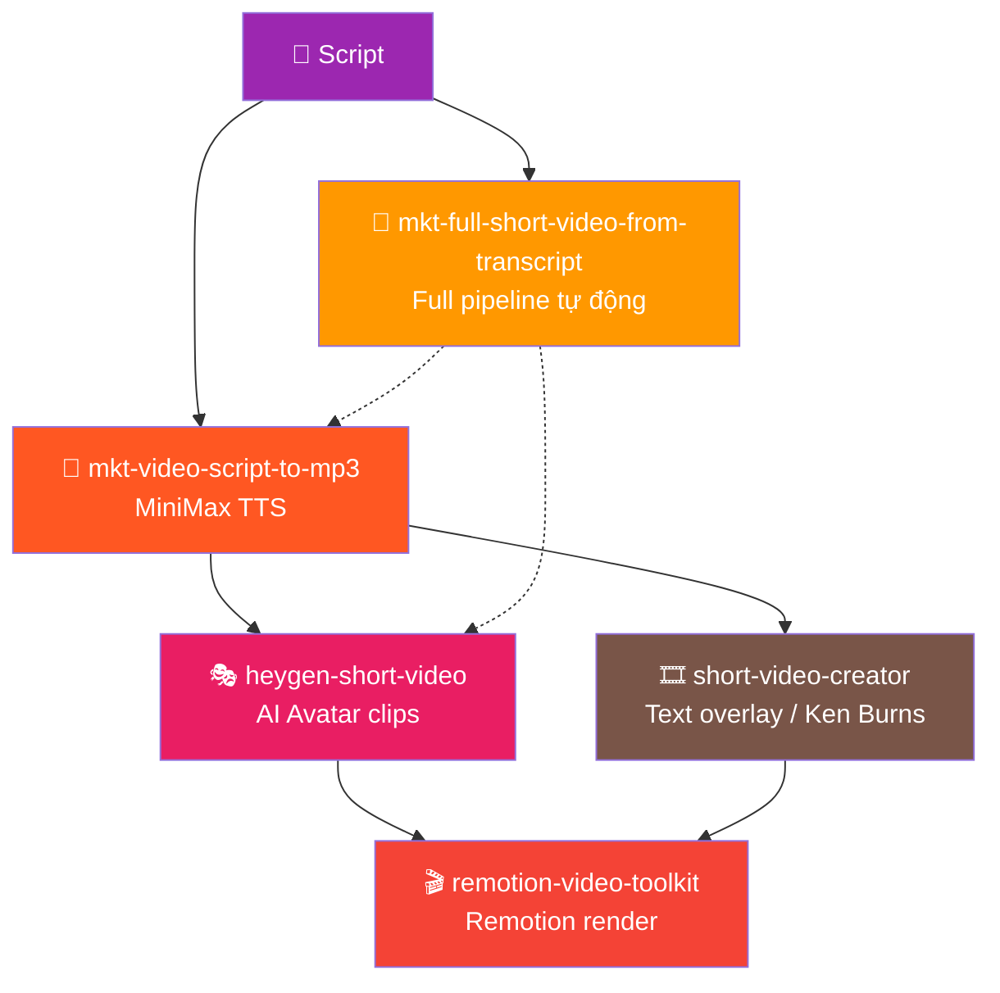
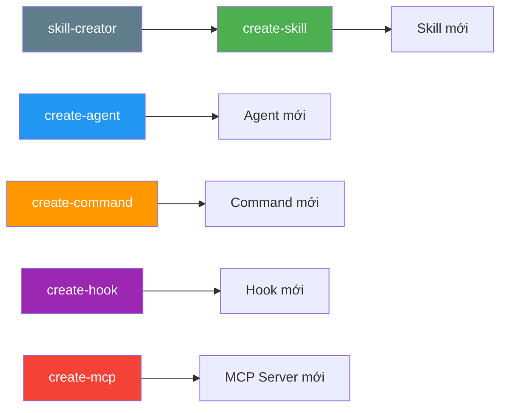
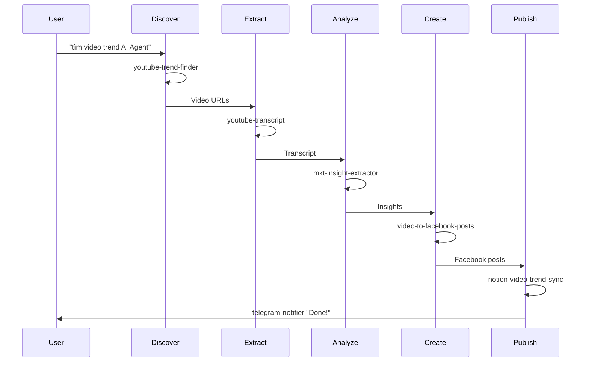
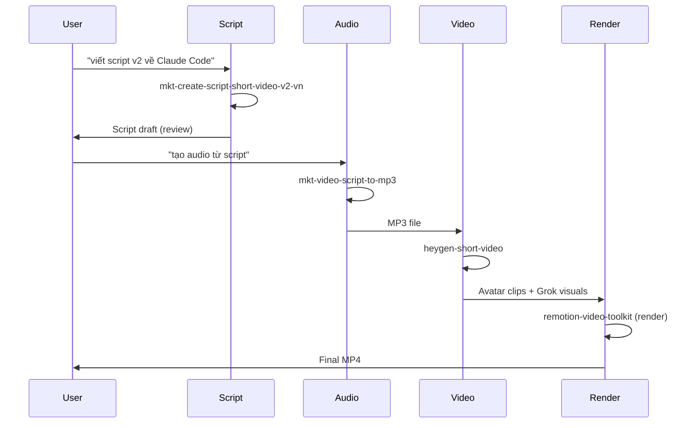
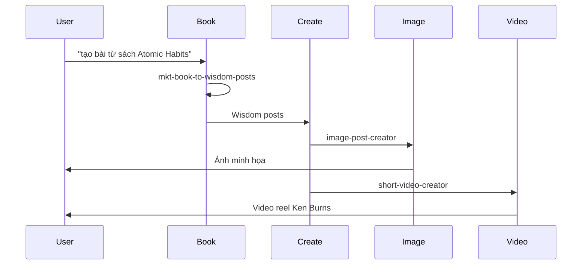
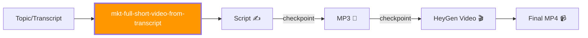

# Hướng Dẫn Sử Dụng Skills — Hoang AI Marketing

> Tài liệu tổng hợp toàn bộ 40 skills trong hệ thống Claude Code, cách sử dụng, và cách chúng kết nối với nhau.

---

## Tổng Quan Hệ Thống

Hệ thống gồm **40 skills** được tổ chức thành **6 nhóm chức năng** theo content production pipeline:



---

## Pipeline Tổng Thể


---

## Chi Tiết Từng Nhóm

### 1. DISCOVER — Tìm kiếm & Thu thập

| Skill | Cách gọi | Input | Output |
|-------|----------|-------|--------|
| **youtube-trend-finder** | `tìm video trend`, `video hot hôm nay` | Keyword + date filter | Danh sách video trending (JSON) |
| **breakout-video-finder** | `find breakout videos`, `tìm video viral` | Keyword + subscriber threshold | Video có tỷ lệ view/sub > 2x |
| **mkt-ai-news-aggregator** | `tin AI hôm nay`, `ai news today` | Topic (optional) | Digest tổng hợp từ Perplexity + GitHub + X.com |

**Ví dụ sử dụng:**
```
> tìm video trend về "AI Agent" tuần này
> find breakout videos about "Claude Code"
> tin AI hôm nay
```

---

### 2. EXTRACT — Trích xuất nội dung

| Skill | Cách gọi | Input | Output |
|-------|----------|-------|--------|
| **youtube-transcript** | `lấy transcript`, `transcript video này` | YouTube URL | Transcript text (có/không timestamps) |

**Ví dụ sử dụng:**
```
> lấy transcript https://youtube.com/watch?v=xxxxx
> transcript video này có timestamps
```

---

### 3. ANALYZE — Phân tích & Đánh giá

| Skill | Cách gọi | Input | Output |
|-------|----------|-------|--------|
| **mkt-insight-extractor** | `bóc insight`, `extract insights` | Transcript text | 5 loại insight (Framework, Paradigm Shift, Warning, Diagnosis, Principle) |
| **mkt-competitor-video-strategy-analyzer** | `phân tích chiến lược video`, `competitor analysis` | Video URLs | Report: title patterns, hook, pacing, thumbnail |
| **mkt-content-format-analyzer** | `phân tích format content` | Transcript/content text | Phân loại 4A (Actionable, Analytical, Aspirational, Anthropological) |
| **script-storytelling-analyzer** | `phân tích storytelling script` | Script/transcript | Report 6 kỹ thuật Callaway + điểm số |
| **mkt-news-to-content-brief** | `tạo content brief từ tin` | News digest | Content briefs có scoring + hooks + format đề xuất |
| **mkt-video-to-content-idea** | `phân tích video làm content` | Video name + transcript + insight | Content ideas cho Facebook |

**Ví dụ sử dụng:**
```
> bóc insight từ transcript này: [paste transcript]
> phân tích chiến lược video của kênh đối thủ
> tạo content brief từ tin AI hôm nay
```

---

### 4. CREATE — Sáng tạo nội dung

#### Script Video

| Skill | Cách gọi | Đặc điểm |
|-------|----------|-----------|
| **mkt-create-script-short-video** | `viết script video ngắn` | V1 — Before-After, Three Acts, Action structure |
| **mkt-create-script-short-video-v2-vn** | `viết script v2`, `script giọng tự nhiên` | V2 — 4 framework mới: Observation-Action, Challenge-Reframe, Skill-Shift, Wake-Up Call. Giọng tự nhiên hơn |
| **mkt-create-script-storytelling-video** | `viết kịch bản YouTube dài` | Full YouTube script — 6 kỹ thuật Callaway + Remotion support |
| **mkt-desire-hook-for-video** | `viết hook cho video` | 5 template hook tâm lý chuyển đổi |

#### Content Posts

| Skill | Cách gọi | Đặc điểm |
|-------|----------|-----------|
| **mkt-book-to-wisdom-posts** | `tạo bài từ sách`, `wisdom post` | 6 format: Progressive Reduction, Never Too Late, Contrast Pairs... |
| **mkt-build-in-public-post-creator** | `build in public post`, `bài behind the scenes` | 5 template chia sẻ hậu trường |
| **mkt-content-repurposer** | `repurpose content`, `tách content` | 1 long-form → 4-5 bài multi-format |
| **video-to-facebook-posts** | `chuyển video thành bài facebook` | Auto-detect knowledge listing vs comparison |
| **landing-page-content-creator** | `tạo landing page` | Quiz-based lead gen landing page |

#### Visual Content

| Skill | Cách gọi | Đặc điểm |
|-------|----------|-----------|
| **mkt-edu-slide-nano** | `tạo slide`, `slide cho video` | Prompt slide chalkboard dev explainer (16 layouts) |
| **image-post-creator** | `tạo ảnh cho bài viết` | Prompt ảnh minh họa Facebook (Nano Banana Pro) |
| **infographic_generator** | `tạo infographic` | Prompt infographic tech/modern style |

**Ví dụ sử dụng:**
```
> viết script v2 về chủ đề "Claude Code thay đổi cách làm việc"
> tạo bài từ sách "Atomic Habits" chương 3
> repurpose content từ transcript video YouTube này
> tạo slide cho script video AI Agent
```

---

### 5. PRODUCE — Sản xuất Video & Media



| Skill | Cách gọi | Input → Output |
|-------|----------|----------------|
| **mkt-video-script-to-mp3** | `tạo audio từ script`, `script to mp3` | Script text → MP3 voiceover (MiniMax TTS) |
| **heygen-short-video** | `tạo video heygen`, `avatar video từ mp3` | MP3 → HeyGen avatar clips + Grok visuals + Remotion compose |
| **short-video-creator** | `tạo video short`, `video text overlay` | Text + background → Video 7-15s (3 templates) |
| **remotion-video-toolkit** | (reference skill) | Kiến thức Remotion: animations, captions, render |
| **mkt-full-short-video-from-transcript** | `tạo video từ đầu đến cuối`, `full video pipeline` | Topic → Script → MP3 → HeyGen → Final MP4 |
| **excalidraw-diagram** | `vẽ diagram`, `tạo sơ đồ` | Mô tả → Excalidraw JSON |

**Ví dụ sử dụng:**
```
> tạo audio từ script: [paste script]
> tạo video heygen từ file mp3 này
> tạo video từ đầu đến cuối về "5 AI tools cho 1-person business"
> tạo video short text overlay "AI thay đổi mọi thứ"
```

---

### 6. DISTRIBUTE & ARCHIVE

| Skill | Cách gọi | Chức năng |
|-------|----------|-----------|
| **notion-video-trend-sync** | `đẩy video lên notion`, `sync video notion` | Push video data → Notion database |
| **notebooklm-video-analyzer** | `analyze videos with notebooklm` | Notion videos → NotebookLM analysis → save back |
| **mkt-content-knowledge-compiler** | `tổng hợp kiến thức`, `update knowledge base` | Compile hooks, formulas, structures → knowledge base |
| **telegram-notifier** | `gửi telegram`, `notify telegram` | Gửi tin nhắn/ảnh/file qua Telegram Bot |

---

## Meta Skills — Mở rộng hệ thống

Các skill dùng để tạo thêm skill/agent/command mới:



| Skill | Cách gọi | Mục đích |
|-------|----------|----------|
| **create-skill** | `create a skill`, `tạo skill mới` | Tạo skill mới cho Claude Code |
| **skill-creator** | (reference guide) | Hướng dẫn thiết kế skill hiệu quả |
| **create-agent** | `create an agent`, `tạo agent mới` | Tạo subagent tự động |
| **create-command** | `create a command`, `tạo command mới` | Tạo slash command |
| **create-hook** | `create a hook`, `tạo hook` | Tạo automation hook |
| **create-mcp** | `add an MCP`, `connect MCP server` | Thêm MCP server integration |

---

## Các Luồng Công Việc Phổ Biến

### Luồng 1: Research → Content (Hàng ngày)



### Luồng 2: Script → Video (Sản xuất)



### Luồng 3: Book → Multi-format Content



### Luồng 4: Full Pipeline Tự Động



> Skill `mkt-full-short-video-from-transcript` tự động orchestrate 3 skill con với checkpoint giữa mỗi phase để user review.

---

## Quick Reference — Tìm Skill Theo Nhu Cầu

| Bạn muốn... | Dùng skill |
|-------------|------------|
| Tìm video trending | `youtube-trend-finder` |
| Tìm video viral tiềm năng | `breakout-video-finder` |
| Lấy transcript YouTube | `youtube-transcript` |
| Bóc insight từ video | `mkt-insight-extractor` |
| Phân tích đối thủ | `mkt-competitor-video-strategy-analyzer` |
| Viết script video ngắn | `mkt-create-script-short-video-v2-vn` |
| Viết kịch bản YouTube dài | `mkt-create-script-storytelling-video` |
| Viết hook mạnh | `mkt-desire-hook-for-video` |
| Tách 1 video thành nhiều bài | `mkt-content-repurposer` |
| Tạo bài Facebook từ video | `video-to-facebook-posts` |
| Tạo wisdom post từ sách | `mkt-book-to-wisdom-posts` |
| Bài behind-the-scenes | `mkt-build-in-public-post-creator` |
| Convert script → audio MP3 | `mkt-video-script-to-mp3` |
| Tạo video avatar AI | `heygen-short-video` |
| Tạo video ngắn text overlay | `short-video-creator` |
| Full pipeline video end-to-end | `mkt-full-short-video-from-transcript` |
| Tạo slide cho video | `mkt-edu-slide-nano` |
| Tạo ảnh minh họa bài viết | `image-post-creator` |
| Đẩy data lên Notion | `notion-video-trend-sync` |
| Gửi thông báo Telegram | `telegram-notifier` |
| Tổng hợp tin AI | `mkt-ai-news-aggregator` |
| Tạo content brief từ tin | `mkt-news-to-content-brief` |
| Tạo landing page | `landing-page-content-creator` |
| Vẽ diagram/sơ đồ | `excalidraw-diagram` |
| Tạo skill/agent/command mới | `create-skill`, `create-agent`, `create-command` |

---

## Agents — Orchestration Tự Động

Ngoài skills, hệ thống có **4 agents** chạy pipeline phức tạp:

| Agent | Trigger | Pipeline |
|-------|---------|----------|
| **trend-researcher** | `nghien cuu video trend` | Search → Transcript (5 parallel) → Summarize → Notion |
| **mkt-pillar1-ai-demo-researcher** | `research AI demo videos` | Fetch AI channels → Transcript → Strategy → Insights → Notion → Telegram |
| **mkt-daily-ai-news-scout** | `daily AI news` | 3 sources parallel → Merge → Content briefs → Telegram top 3 |
| **mcp-finder** | `find MCP server` | Search NPM + GitHub + MCP directories |

---

*Cập nhật: 2026-03-16 — 40 skills, 4 agents, 6 meta skills*
