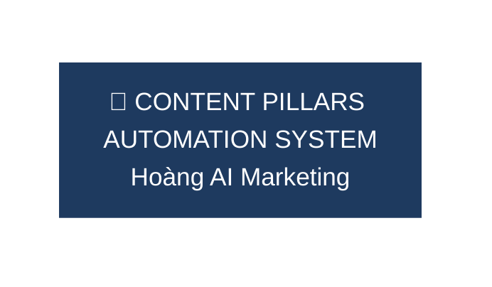
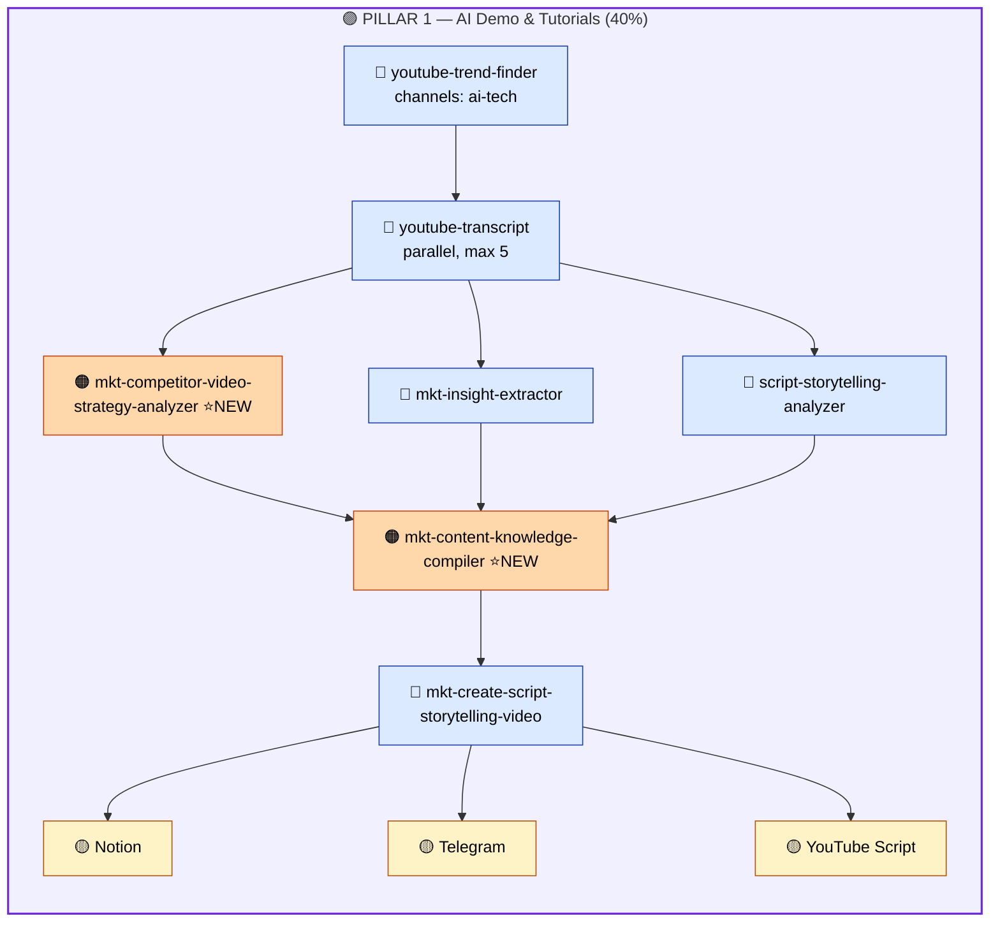
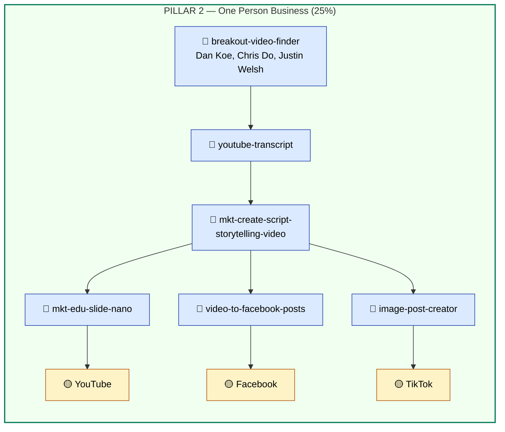
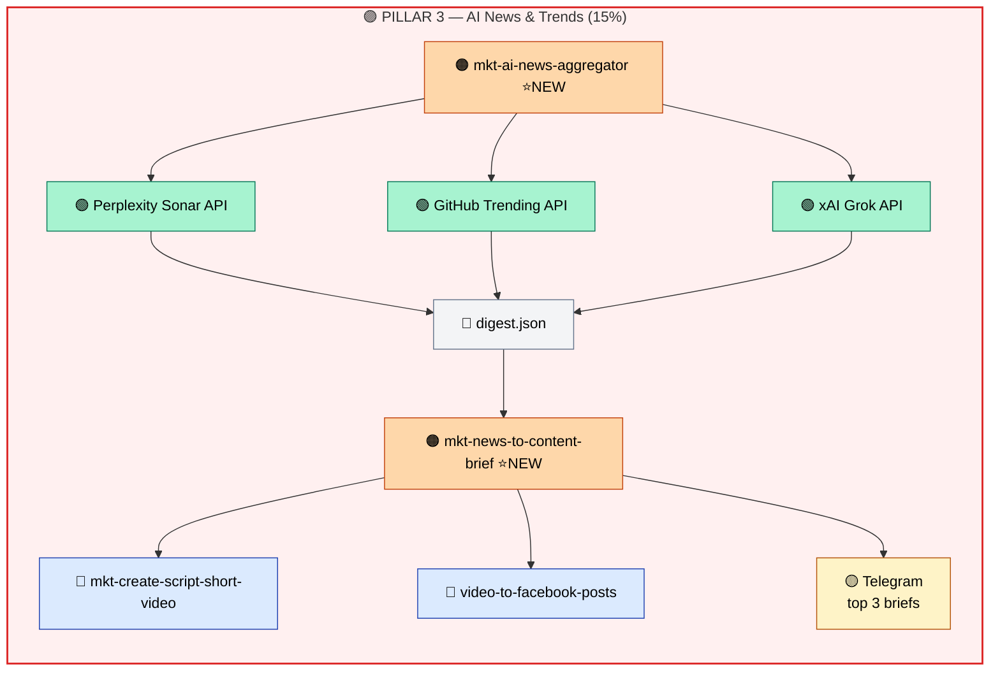
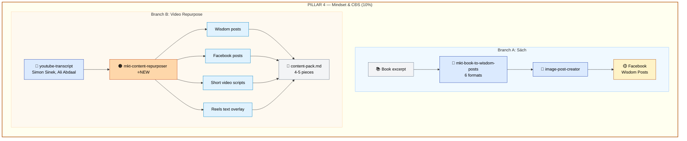
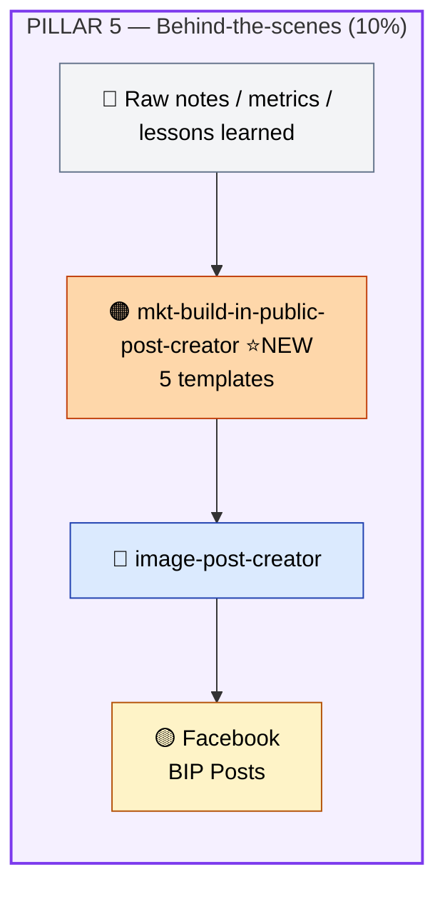
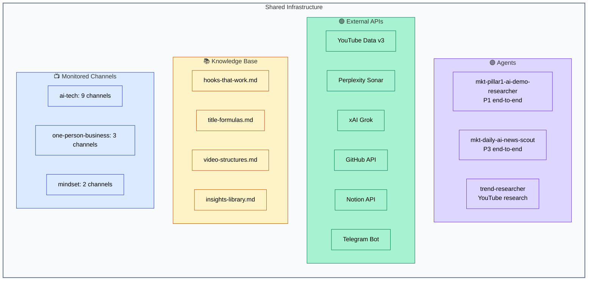
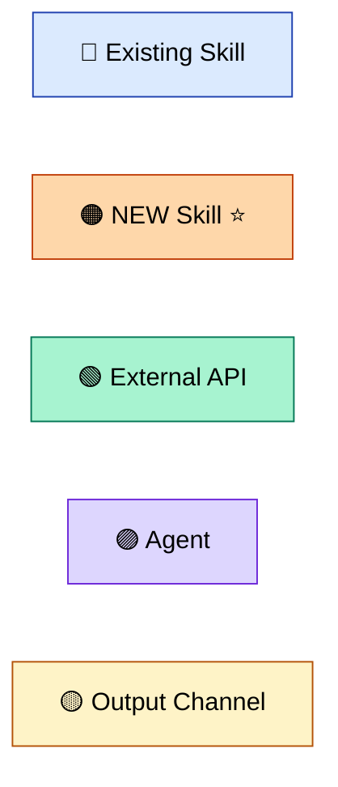

# Content Pillars Automation System — Hoang AI Marketing

> 5 Pillars | 35+ Skills | 4 Agents | 3 External APIs

---

## Tong quan he thong

---

## PILLAR 1: AI Demo & Tutorials (40%)

**Agent: `mkt-pillar1-ai-demo-researcher`**

---

## PILLAR 2: One Person Business (25%)

**Manual trigger — no agent**

---

## PILLAR 3: AI News & Trends (15%)

**Agent: `mkt-daily-ai-news-scout`**

---

## PILLAR 4: Mindset & Chuyen doi so (10%)

**Two branches — no agent**

---

## PILLAR 5: Behind-the-scenes (10%)

**Manual trigger — no agent**

---

## Shared Infrastructure

---

## Legend

---

## New Items Created

### 6 New Skills
1. `mkt-competitor-video-strategy-analyzer` — P1
2. `mkt-content-knowledge-compiler` — P1
3. `mkt-ai-news-aggregator` (+ 3 Python scripts) — P3
4. `mkt-news-to-content-brief` — P3
5. `mkt-content-repurposer` — P4
6. `mkt-build-in-public-post-creator` (+ templates) — P5

### 2 New Agents
1. `mkt-pillar1-ai-demo-researcher` — P1 end-to-end
2. `mkt-daily-ai-news-scout` — P3 end-to-end
